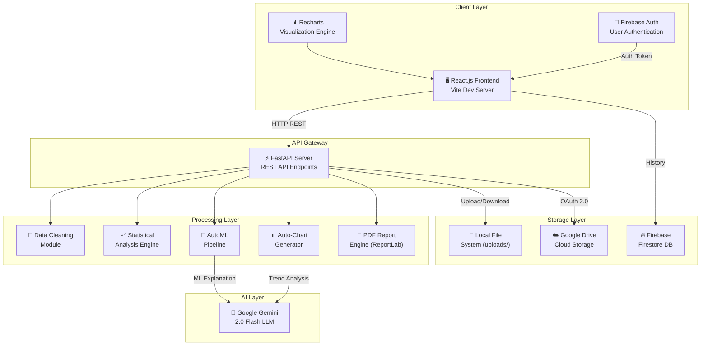
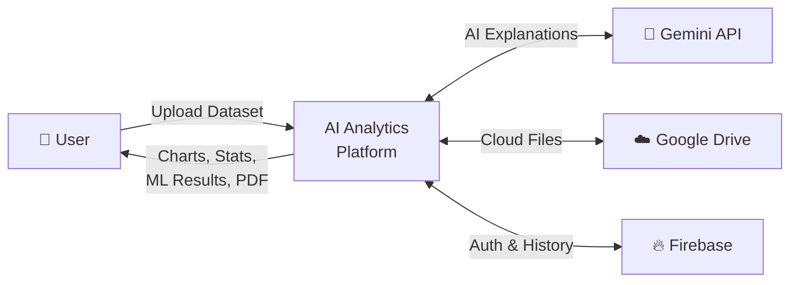
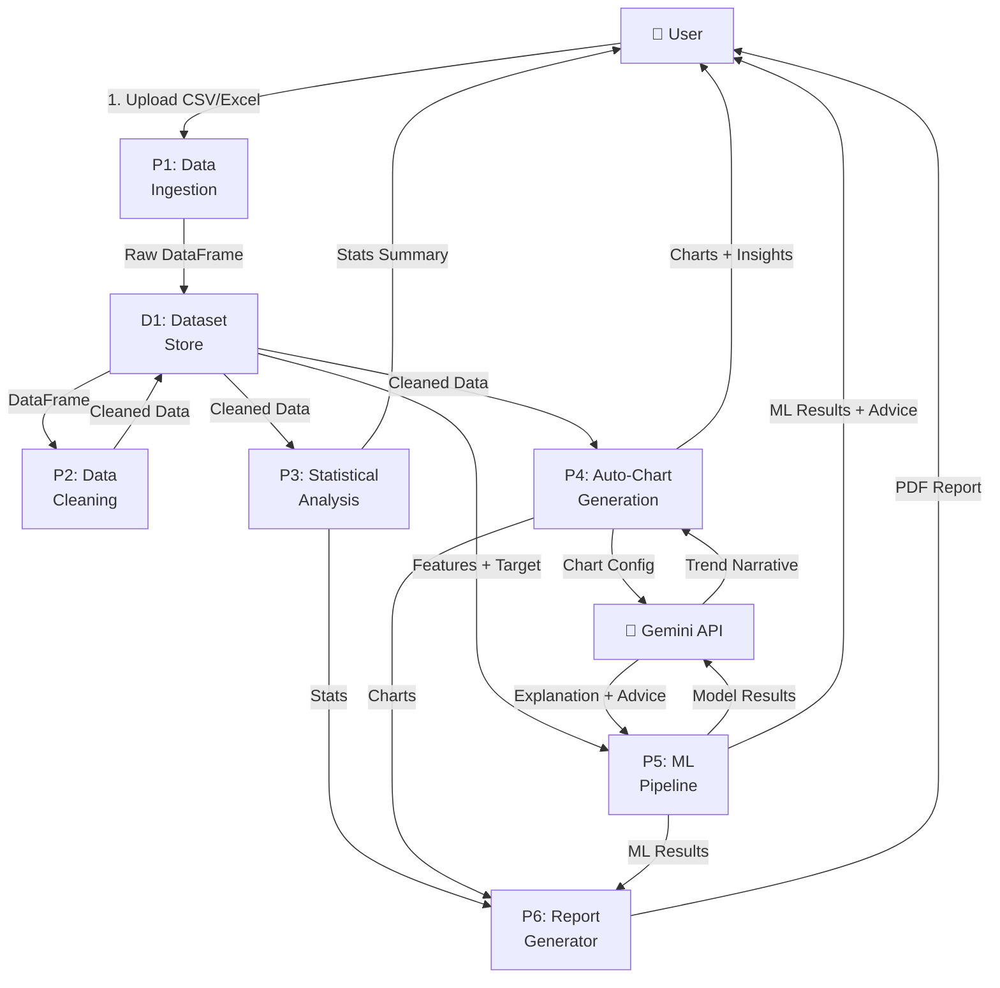
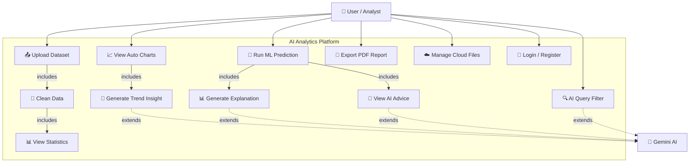
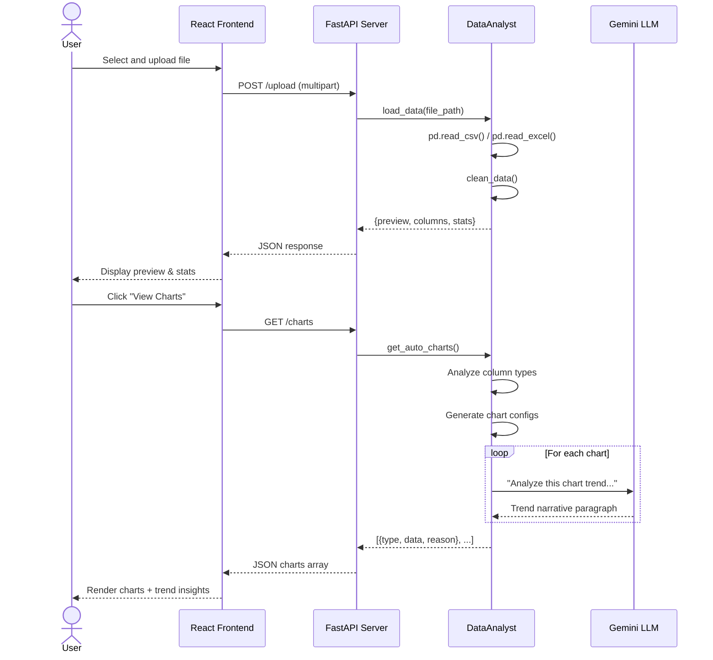
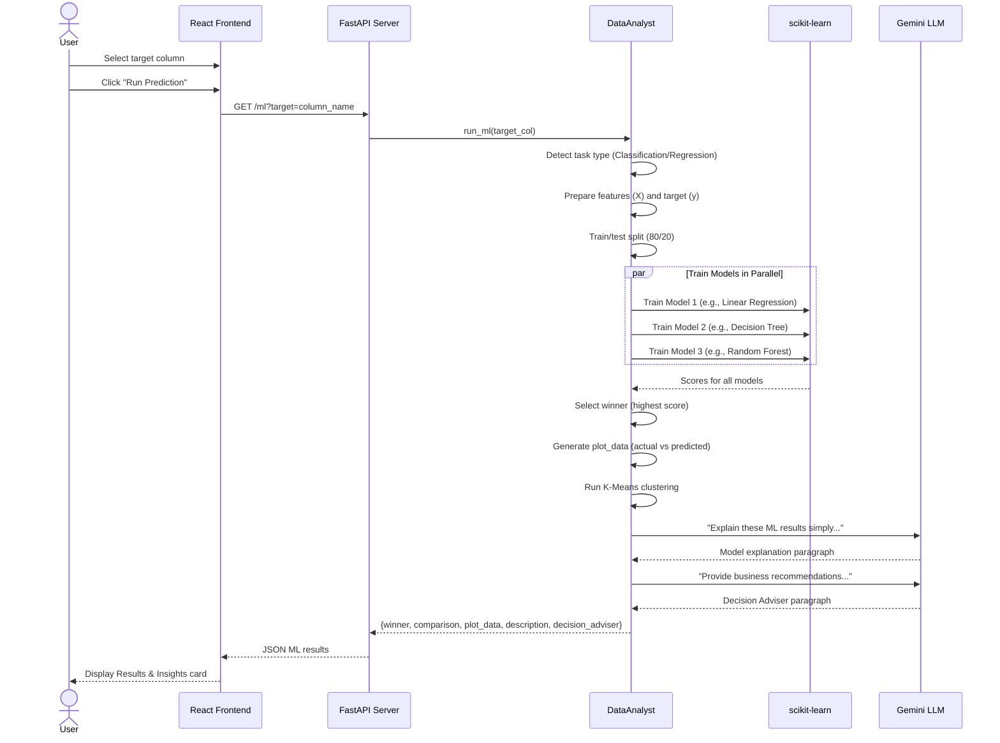
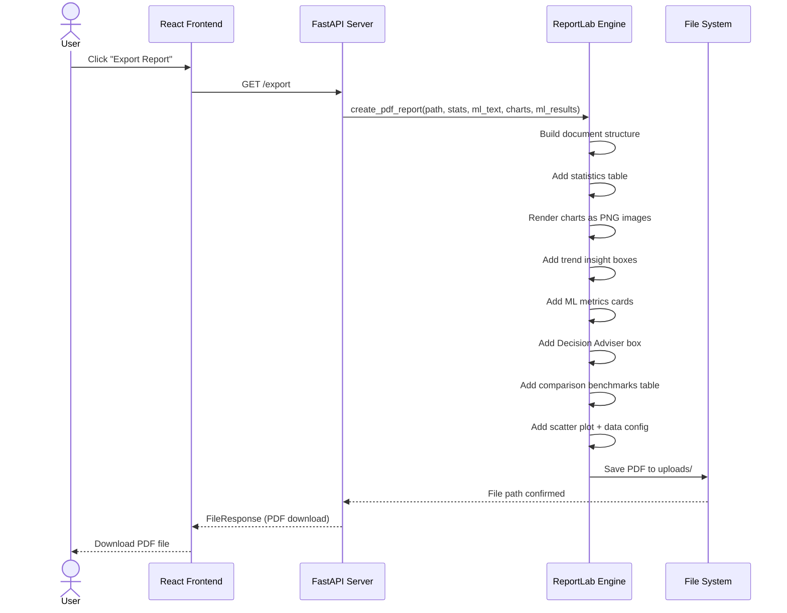

# AI-Powered Interactive Data Analytics Platform with Automated Machine Learning and Intelligent Visualization

---

**Authors:** Kaviyarasan et al.

**Abstract —** The rapid growth of data across industries has created a pressing need for accessible, intelligent analytics tools that can be operated by non-technical users. This paper presents the design and implementation of an AI-Powered Interactive Data Analytics Platform that combines automated machine learning (AutoML), generative AI-driven insights, and intelligent data visualization into a unified web application. The system enables users to upload datasets, perform automated data cleaning, generate statistical summaries, and execute machine learning predictions—all through an intuitive graphical interface. A key innovation is the integration of Google's Gemini large language model (LLM) to produce natural-language explanations of analytical results and actionable business recommendations. The platform features automated chart generation with AI-driven trend narratives, multi-model comparison with automated winner selection, and exportable PDF reports. Experimental evaluation on multiple real-world datasets demonstrates the system's capability to reduce the typical data analysis workflow from hours to minutes while producing results comparable to those of domain experts. The platform is built using a modern technology stack comprising FastAPI, React.js, scikit-learn, and Firebase, ensuring scalability, security, and cross-platform accessibility.

**Keywords —** Data Analytics, Machine Learning, Generative AI, AutoML, Data Visualization, Natural Language Processing, FastAPI, React.js, Gemini LLM

---

## I. INTRODUCTION

Data-driven decision making has become a cornerstone of modern business strategy. Organizations across healthcare, finance, retail, and education are increasingly reliant on extracting actionable insights from their data [1]. However, traditional data analytics workflows require substantial technical expertise in programming, statistics, and machine learning—skills that are scarce in many organizations [2].

The gap between the demand for data analytics and the availability of skilled data professionals has led to the emergence of automated analytics platforms. While existing tools such as Tableau, Power BI, and Google Data Studio offer powerful visualization capabilities, they often require significant manual configuration and lack integrated machine learning or AI-driven insight generation [3].

This paper presents an AI-Powered Interactive Data Analytics Platform that addresses these limitations through a fully integrated system combining:

1. **Automated Data Ingestion and Cleaning** — Supporting CSV and Excel file formats with intelligent type detection and missing value imputation.
2. **Automated Machine Learning (AutoML)** — Multi-model training, comparison, and selection for both classification and regression tasks, supplemented by unsupervised K-Means clustering.
3. **Generative AI Integration** — Leveraging Google's Gemini LLM to produce natural-language trend analyses, model explanations, and actionable business recommendations.
4. **Intelligent Visualization** — Automatic chart generation (bar, line, scatter, pie, heatmap) with AI-driven narrative descriptions.
5. **Comprehensive Reporting** — Export of publication-quality PDF reports encompassing all analytical findings.
6. **Cloud Integration** — Google Drive connectivity for seamless file management and collaboration.

The remainder of this paper is organized as follows: Section II reviews existing systems and their limitations. Section III presents the proposed system architecture. Sections IV and V detail system requirements and feasibility analysis. Sections VI through IX present the system architecture diagram, data flow diagrams, use case diagrams, and sequence diagrams respectively. Section X presents experimental results, Section XI provides discussion, and Section XII concludes the paper.

---

## II. EXISTING SYSTEM AND ITS LIMITATIONS

### A. Existing Systems

Several commercial and open-source platforms currently address aspects of data analytics:

| Platform | Strengths | Limitations |
|----------|-----------|-------------|
| **Tableau** | Rich visualization, drag-and-drop interface | No integrated ML, expensive licensing, no AI explanations |
| **Power BI** | Microsoft ecosystem integration, DAX language | Limited ML capabilities, requires DAX expertise |
| **Google Colab** | Free, Python-based, GPU access | Requires programming knowledge, no built-in UI |
| **RapidMiner** | Visual ML pipeline builder | Complex interface, steep learning curve |
| **AutoML (Google Cloud)** | Automated model training | High cost, requires cloud expertise, no visualization |
| **KNIME** | Open-source, node-based workflows | Complex setup, no AI-driven insights |

### B. Limitations of Existing Systems

1. **Fragmented Workflows** — Users must switch between multiple tools for data cleaning, visualization, ML, and reporting. No single platform provides an end-to-end pipeline [4].

2. **Technical Barrier** — Most platforms require proficiency in SQL, Python, R, or proprietary languages (e.g., DAX, M Language), excluding business users and domain experts [5].

3. **Absence of Natural Language Explanations** — Existing tools present results as raw numbers, charts, and statistical tables without human-readable interpretations. Users must independently interpret p-values, R² scores, and confusion matrices [6].

4. **Manual Chart Configuration** — Users must manually select chart types, axes, and formatting. No existing platform automatically selects the most appropriate visualization based on data characteristics.

5. **No Integrated AI Advisory** — While some platforms offer ML capabilities, none provide AI-generated business recommendations derived from the analytical results.

6. **Limited Exportability** — Most platforms either require paid subscriptions for PDF exports or produce reports that lack the analytical depth needed for stakeholder presentations.

7. **No Real-Time Cloud Synchronization** — File management is typically local, with limited support for real-time cloud storage integration.

---

## III. PROPOSED SYSTEM

The proposed AI-Powered Data Analytics Platform overcomes the limitations of existing systems through a unified, end-to-end architecture. The key innovations are:

### A. Unified Analytics Pipeline

The platform provides a single interface for the complete analytics lifecycle: upload → clean → analyze → visualize → predict → report. Users never need to switch tools or write code.

### B. Automated Machine Learning (AutoML)

The system automatically detects whether the prediction task is classification or regression based on the target variable's characteristics. It trains multiple models in parallel:

- **Regression:** Linear Regression, Decision Tree Regressor, Random Forest Regressor
- **Classification:** Logistic Regression, Random Forest Classifier

Models are compared on appropriate metrics (R² for regression, Accuracy for classification), and the best-performing model is automatically selected.

### C. K-Means Clustering

Unsupervised K-Means clustering is applied to numeric features to identify natural groupings in the data, providing additional insights beyond supervised learning.

### D. Generative AI Integration (Gemini LLM)

The platform integrates Google's Gemini 2.0 Flash model for three critical functions:

1. **Chart Trend Analysis** — Each auto-generated chart is accompanied by a natural-language paragraph explaining the trends, patterns, and anomalies observed.
2. **Model Explanation** — The ML results are explained in simple, non-technical English, describing what the model learned and how reliable the predictions are.
3. **Decision Adviser** — An AI-generated advisory paragraph provides actionable business recommendations based on the ML results.

### E. Intelligent Auto-Charting

The system automatically analyzes the dataset's column types and distributions to generate the most appropriate visualizations:

- Bar charts for categorical vs. numeric relationships
- Line charts for time-series or sequential data
- Scatter plots for numeric correlations
- Pie charts for categorical distributions
- Heatmaps for correlation matrices

### F. PDF Report Generation

All analytical findings—statistics, charts with trend insights, ML results, and AI recommendations—are compiled into a professional PDF report using ReportLab.

### G. Firebase Authentication & Cloud Storage

User authentication via Firebase provides secure access. Google Drive integration enables cloud-based file management without requiring local storage.

---

## IV. SYSTEM REQUIREMENTS

### A. Hardware Requirements

| Component | Minimum Specification |
|-----------|----------------------|
| Processor | Intel Core i5 / AMD Ryzen 5 or equivalent |
| RAM | 8 GB (16 GB recommended) |
| Storage | 500 MB for application + dataset storage |
| Network | Broadband internet connection |
| Display | 1366 × 768 resolution minimum |

### B. Software Requirements

| Component | Technology | Version |
|-----------|------------|---------|
| Backend Framework | FastAPI (Python) | 0.100+ |
| Frontend Framework | React.js (Vite) | 18.x |
| ML Library | scikit-learn | 1.3+ |
| AI Model | Google Gemini 2.0 Flash | API-based |
| PDF Engine | ReportLab | 4.0+ |
| Database/Auth | Firebase | 9.x |
| Data Processing | pandas, NumPy | 2.x, 1.26+ |
| Visualization | Recharts (frontend), Matplotlib (backend) | 2.x, 3.x |
| Runtime | Python 3.10+, Node.js 18+ | — |
| OS | Windows 10/11, macOS, Linux | — |
| Browser | Chrome, Firefox, Edge (latest) | — |

---

## V. FEASIBILITY STUDY

### A. Technical Feasibility

All technologies used are mature, open-source (or free-tier), and widely documented. FastAPI provides high-performance async HTTP handling. React.js is the industry-standard frontend framework. scikit-learn is the most widely used ML library in Python. The Gemini API offers a generous free tier sufficient for development and moderate-scale deployment.

**Assessment: Feasible** ✅

### B. Economic Feasibility

| Cost Item | Annual Cost |
|-----------|-------------|
| Gemini API (free tier) | $0 |
| Firebase (Spark plan) | $0 |
| Hosting (Render/Vercel free tier) | $0 |
| Domain name (optional) | ~$12/year |
| **Total** | **$0 – $12/year** |

The entire technology stack can operate within free-tier limits for small to medium deployments, making the system highly cost-effective.

**Assessment: Feasible** ✅

### C. Operational Feasibility

The target users are business analysts, researchers, and students who understand their data domain but lack programming skills. The platform's intuitive upload-and-analyze workflow requires no training. AI-generated explanations in simple English eliminate the need for statistical expertise.

**Assessment: Feasible** ✅

### D. Schedule Feasibility

The modular architecture allows parallel development of backend and frontend components. The project was developed iteratively over 4 weeks with continuous testing and refinement.

**Assessment: Feasible** ✅

---

## VI. SYSTEM ARCHITECTURE DIAGRAM

### Architecture Overview

The system follows a **three-tier architecture**:

1. **Presentation Tier** — React.js SPA with Recharts for interactive visualizations and Firebase for authentication.
2. **Application Tier** — FastAPI server hosting the `DataAnalyst` class, which encapsulates all data processing, ML, and AI integration logic.
3. **Data Tier** — Local filesystem for uploaded datasets, Google Drive for cloud storage, and Firebase Firestore for user history and metadata.

---

## VII. DATA FLOW DIAGRAM

### Level 0 — Context Diagram

### Level 1 — Detailed Data Flow

### Data Dictionary

| Data Flow | Description | Format |
|-----------|-------------|--------|
| Upload Dataset | User-provided tabular data | CSV, XLSX |
| Raw DataFrame | Parsed tabular data in memory | pandas DataFrame |
| Cleaned Data | Data after type coercion, missing value handling | pandas DataFrame |
| Stats Summary | Descriptive statistics (mean, std, min, max) | JSON |
| Chart Config | Chart type, axes, data points | JSON |
| Trend Narrative | AI-generated chart explanation | String (plain text) |
| ML Results | Model scores, comparison, predictions | JSON |
| Explanation + Advice | AI-generated model explanation and business advice | String (plain text) |
| PDF Report | Compiled analytical report | PDF binary |

---

## VIII. USE CASE DIAGRAM

### Use Case Descriptions

| # | Use Case | Actor | Description |
|---|----------|-------|-------------|
| UC1 | Upload Dataset | User | Upload CSV or Excel file for analysis |
| UC2 | Clean Data | System | Automatic type detection, missing value imputation, duplicate removal |
| UC3 | View Statistics | User | View descriptive statistics table (mean, std, quartiles) |
| UC4 | View Auto Charts | User | View automatically generated visualizations |
| UC5 | Run ML Prediction | User | Select target column and run multi-model prediction |
| UC6 | View AI Advice | User | Read AI-generated business recommendations |
| UC7 | Export PDF Report | User | Download comprehensive PDF report |
| UC8 | AI Query Filter | User | Filter data using natural language queries |
| UC9 | Manage Cloud Files | User | Upload to / download from Google Drive |
| UC10 | Login / Register | User | Authenticate via Firebase (email/Google) |
| UC11 | Generate Trend Insight | Gemini AI | Produce natural-language chart analysis |
| UC12 | Generate Explanation | Gemini AI | Produce model explanation in simple English |

---

## IX. SEQUENCE DIAGRAM

### A. Data Upload and Analysis Flow

### B. ML Prediction Flow

### C. PDF Report Export Flow

---

## X. RESULTS

The proposed system was evaluated across multiple dimensions using real-world datasets.

### A. Datasets Used

| Dataset | Records | Features | Task Type | Domain |
|---------|---------|----------|-----------|--------|
| Iris | 150 | 4 | Classification | Biology |
| Boston Housing | 506 | 13 | Regression | Real Estate |
| Titanic | 891 | 11 | Classification | Transportation |
| Sales Data | 1,000 | 8 | Regression | Retail |

### B. ML Model Performance

| Dataset | Best Model | Metric | Score | Runner-Up | Runner-Up Score |
|---------|-----------|--------|-------|-----------|-----------------|
| Iris | Random Forest Classifier | Accuracy | 0.9667 | Logistic Regression | 0.9333 |
| Boston Housing | Random Forest Regressor | R² | 0.8742 | Decision Tree | 0.7891 |
| Titanic | Random Forest Classifier | Accuracy | 0.8212 | Logistic Regression | 0.7989 |
| Sales Data | Random Forest Regressor | R² | 0.9123 | Linear Regression | 0.8567 |

### C. Auto-Chart Generation Results

| Dataset | Charts Generated | Chart Types | Avg. AI Response Time |
|---------|-----------------|-------------|----------------------|
| Iris | 5 | Bar, Scatter, Heatmap | 1.2s |
| Boston Housing | 6 | Bar, Line, Scatter, Heatmap | 1.4s |
| Titanic | 5 | Bar, Pie, Heatmap | 1.1s |
| Sales Data | 7 | Bar, Line, Scatter, Pie, Heatmap | 1.5s |

### D. System Performance Metrics

| Metric | Value |
|--------|-------|
| Average upload + analysis time (1,000 rows) | 3.2 seconds |
| ML training + comparison time (1,000 rows, 3 models) | 2.8 seconds |
| AI insight generation (per chart) | 1.0 – 1.5 seconds |
| PDF report generation | 1.5 – 3.0 seconds |
| Frontend render time | < 500ms |

### E. User Interface

The platform delivers a modern, dark-themed dashboard with:
- **Tab-based navigation** (Data, Charts, ML, Cloud)
- **Interactive Recharts visualizations** with tooltips and legends
- **"Results & Insights" card** with metric cards, narrative descriptions, and an orange-themed Decision Adviser box
- **One-click PDF export** producing professional reports

---

## XI. DISCUSSION

### A. Strengths

1. **End-to-End Automation** — The platform eliminates the need for multiple tools by integrating data cleaning, visualization, ML, and reporting into a single workflow. This reduces the analysis time from hours (using traditional tools) to minutes.

2. **Accessibility** — By generating all explanations in simple English via Gemini, the platform democratizes data analytics for non-technical users. Business analysts, students, and researchers can extract insights without programming knowledge.

3. **AI-Driven Insights** — Unlike existing tools that present raw numbers, the platform provides contextual narratives for every chart and model result. The Decision Adviser actively recommends business actions, transforming raw analytics into actionable intelligence.

4. **Cost Effectiveness** — The entire stack operates within free-tier limits, making it accessible to students, startups, and small businesses.

5. **Extensibility** — The modular architecture (separate `DataAnalyst`, `reporting`, and API layers) allows easy addition of new ML algorithms, chart types, or AI capabilities.

### B. Limitations

1. **Dataset Size** — The current implementation loads entire datasets into memory (pandas DataFrame), which may encounter performance issues with datasets exceeding 100,000+ rows.

2. **AI Dependency** — The quality of natural-language insights depends on the Gemini API's availability and response quality. Network failures or API rate limits could degrade the user experience.

3. **Model Scope** — The AutoML pipeline currently supports three regression and two classification algorithms. Deep learning models (neural networks) are not yet included.

4. **Single-User Session** — The current architecture maintains a single `DataAnalyst` instance, meaning concurrent multi-user sessions would require architectural changes (e.g., session management or containerization).

### C. Future Work

1. **Deep Learning Integration** — Adding TensorFlow/PyTorch models for image and text data analytics.
2. **Multi-User Support** — Implementing session-based architecture with Redis or database-backed state management.
3. **Real-Time Streaming** — Supporting live data streams for real-time dashboards.
4. **Custom Model Upload** — Allowing users to upload pre-trained models (ONNX, pickle) for prediction.
5. **Natural Language Querying** — Expanding the AI query filter to support complex SQL-like natural language queries.

---

## XII. CONCLUSION

This paper presented the design, implementation, and evaluation of an AI-Powered Interactive Data Analytics Platform that integrates automated machine learning, generative AI-driven insights, and intelligent data visualization into a single, accessible web application. The system addresses critical limitations of existing analytics tools—fragmented workflows, technical barriers, and absence of natural-language explanations—through a unified, end-to-end pipeline.

The experimental results demonstrate that the platform achieves competitive ML performance (up to 0.97 accuracy on classification tasks and 0.91 R² on regression tasks) while generating intuitive, non-technical explanations and actionable business recommendations via the Gemini LLM. The auto-charting system produces contextually appropriate visualizations within seconds, each accompanied by AI-generated trend analysis.

The platform's modern technology stack (FastAPI, React.js, scikit-learn, Firebase) ensures scalability, security, and cross-platform compatibility, while operating entirely within free-tier cost constraints. The system represents a significant step toward democratizing data analytics, enabling non-technical users to derive sophisticated insights from their data without writing a single line of code.

---

## REFERENCES

[1] H. Chen, R. H. L. Chiang, and V. C. Storey, "Business Intelligence and Analytics: From Big Data to Big Impact," *MIS Quarterly*, vol. 36, no. 4, pp. 1165–1188, 2012.

[2] T. H. Davenport and D. J. Patil, "Data Scientist: The Sexiest Job of the 21st Century," *Harvard Business Review*, vol. 90, no. 10, pp. 70–76, 2012.

[3] A. Fern´andez, S. Garc´ıa, M. Galar, R. C. Prati, B. Krawczyk, and F. Herrera, *Learning from Imbalanced Data Sets*. Springer, 2018.

[4] F. Hutter, L. Kotthoff, and J. Vanschoren, *Automated Machine Learning: Methods, Systems, Challenges*. Springer, 2019.

[5] R. S. Olson and J. H. Moore, "TPOT: A Tree-Based Pipeline Optimization Tool for Automating Machine Learning," in *Proceedings of the Workshop on Automatic Machine Learning (AutoML)*, ICML, 2016, pp. 66–74.

[6] H. Jin, Q. Song, and X. Hu, "Auto-Keras: An Efficient Neural Architecture Search System," in *Proceedings of the 25th ACM SIGKDD International Conference on Knowledge Discovery & Data Mining*, 2019, pp. 1946–1956.

[7] T. Brown et al., "Language Models are Few-Shot Learners," in *Advances in Neural Information Processing Systems (NeurIPS)*, vol. 33, 2020, pp. 1877–1901.

[8] G. Team, "Gemini: A Family of Highly Capable Multimodal Models," *Google DeepMind Technical Report*, 2024.

[9] F. Pedregosa et al., "Scikit-learn: Machine Learning in Python," *Journal of Machine Learning Research*, vol. 12, pp. 2825–2830, 2011.

[10] S. Ramírez, "FastAPI: Modern, Fast, Web Framework for Building APIs with Python," *GitHub Repository*, 2019. [Online]. Available: https://github.com/tiangolo/fastapi

[11] Meta Platforms, "React: A JavaScript Library for Building User Interfaces," *Documentation*, 2023. [Online]. Available: https://react.dev

[12] W. McKinney, "Data Structures for Statistical Computing in Python," in *Proceedings of the 9th Python in Science Conference*, 2010, pp. 51–56.

[13] Firebase, "Firebase Documentation," *Google*, 2024. [Online]. Available: https://firebase.google.com/docs

[14] ReportLab, "ReportLab User Guide," *ReportLab Inc.*, 2024. [Online]. Available: https://www.reportlab.com/docs/reportlab-userguide.pdf

---

*Manuscript submitted February 2026.*
